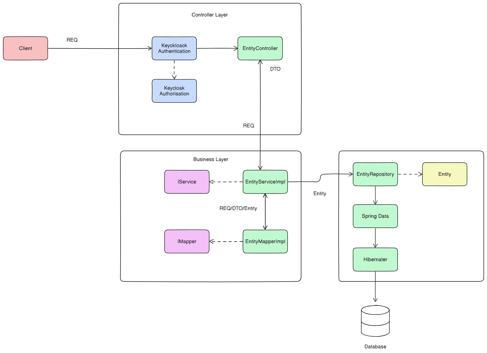
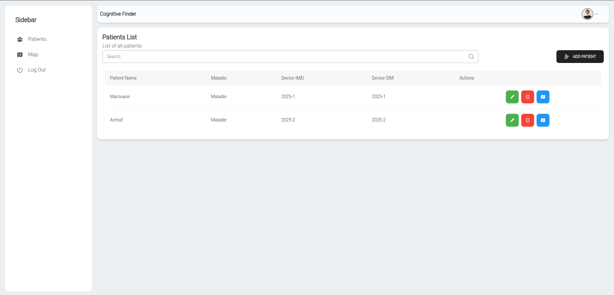
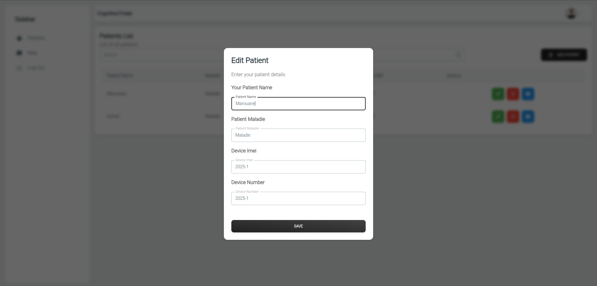
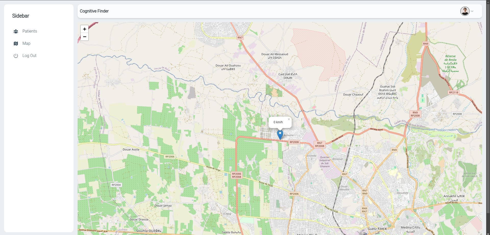
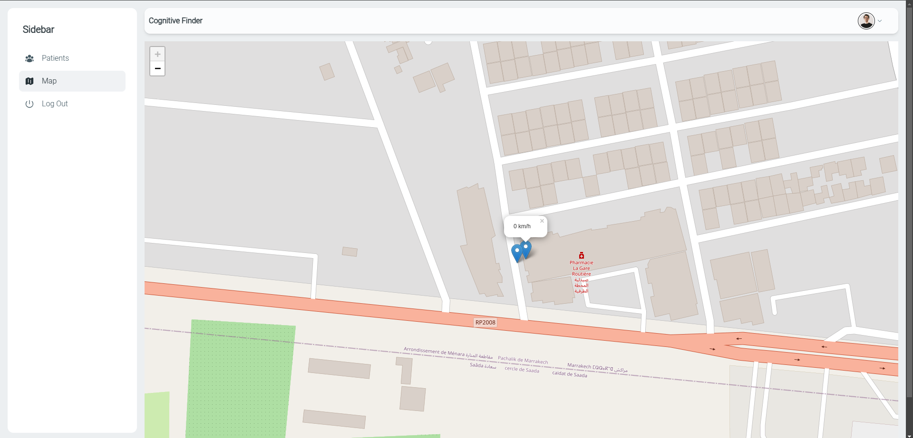
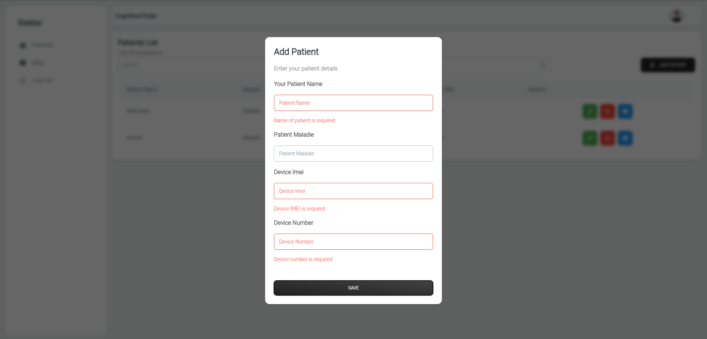

# Cognitive Finder: Localization of Patients with Cognitive Disorders

## Demo
[](https://youtu.be/SFVhbytsy_M)
## Introduction

Cognitive disorders, such as Alzheimer's disease, pose significant challenges to patient safety, especially with the risk of wandering or elopement. This project proposes a solution using wearable sensors to monitor patients with cognitive impairments in real-time. The system tracks patient movements and detects when a patient leaves a predefined safe zone or exhibits unusual movement behaviors. Alerts are triggered to caregivers to enable prompt intervention, improving patient security and preventing dangerous situations.

## Features

- **Real-time Monitoring**: The system tracks patient movements using wearable sensors, detecting when the patient leaves a safe zone or exhibits unusual behavior.
- **Immediate Alerts**: Caregivers receive instant alerts through the notification service when a patient is at risk.
- **Microservices Architecture**: The backend consists of various microservices, including patient management, tracking, and notifications, ensuring scalability and maintainability.
- **Cloud Infrastructure**: Deployed in the cloud with Kubernetes and Docker for scaling, and CI/CD pipeline integration for continuous deployment.
- **Multiple Frontends**: The system uses Angular and Flutter for the frontend to provide responsive and accessible interfaces for caregivers.

## How to Install and Run

### Prerequisites

1. **Docker**: Ensure Docker and Docker Compose are installed.
2. **JDK 21.0.5**: Required for Spring Boot applications.
3. **Node.js v18.20.4**: Required for Angular applications.
4. **Angular 18.2.9**: Installed globally via npm.
5. **MySQL 8.0**: For managing patient and tracking data.

### Steps

1. Clone the repository:
   ```bash
   git clone https://github.com/Devolpex/cognitive-finder
   cd cognitive-finder
   ```

2. Set up Docker containers for services:
   ```bash
   docker compose compose.yml up -d
   ```

3. Start the frontend applications:
   - Angular frontend:
     ```bash
     cd frontend
     npm install
     ng serve
     ```
   <!-- - Flutter frontend:
     ```bash
     cd frontend/flutter-app
     flutter run
     ``` -->

4. Access the system through the web interface:
   - **Angular**: Navigate to `http://localhost:4200`
   <!-- - **Flutter**: Access via mobile or emulator. -->

## Structure of Repositories

The project is organized into various services, each responsible for specific functionality:

```bash
cognitive-finder/
│
├── api-gateway/                # API Gateway for routing requests to microservices
├── compose.yml                 # Docker Compose file for container orchestration
├── docker/                     # Docker-related files
├── docs/                       # Documentation files
├── frontend/                   # Frontend code (Angular)
├── lib/                        # Shared libraries used by multiple microservices
├── patient-ms/                 # Patient management microservice
├── production/                 # Production deployment configurations
├── tracking-ms/                # Tracking microservice for GPS data and alerts
└── README.md                   # Project ReadMe file

```

### Key Services

1. **API Gateway**: Routes requests to appropriate microservices and handles service discovery.
2. **Patient Management Service**: Manages patient data using MongoDB.
3. **Tracking Service**: Handles GPS tracking data from wearable devices and stores it in PostgreSQL.

## Architecture

### Microservices Architecture

This system uses a microservices architecture, where each service is responsible for a specific task and interacts with others via APIs. The services are loosely coupled, allowing for easy scaling and maintenance. The microservices are:

- **Patient Management**: Stores and manages patient data.
- **Tracking Service**: Processes GPS data and triggers alerts.
- **Notification Service**: Sends notifications to caregivers.
- **User Service**: Handles user registration and authentication.
<div align="center">
  
</div>

### Backend Architecture

The backend architecture is designed to maintain a clean separation of concerns, ensuring flexibility, security, and scalability. It is divided into three primary layers:
<div align="center">
  
</div>

#### 1. Controller Layer
This layer serves as the entry point for handling incoming requests. It integrates **Keycloak** to manage authentication and authorization, ensuring that only authorized users can access specific resources. The controllers communicate with the business layer via **EntityService**, which implements the **IServiceLayer** interface to process business logic effectively.

#### 2. Business Layer
The core logic of the system resides here. It utilizes **EntityMapper** to handle the transformation of **Data Transfer Objects (DTOs)**, ensuring seamless interaction between the controller and entity layers. This layer is responsible for validating, processing, and preparing data before it reaches the underlying entity layer.

#### 3. Entity Layer
This layer manages database interactions through **EntityRepository**, which is responsible for querying and manipulating data directly from the database.


*This architecture is built with a strong focus on safeguarding data, maintaining precision, and promoting maintainability. By isolating responsibilities across layers and implementing stringent authorization checks, it provides a flexible and secure foundation for protecting entities and ensuring system integrity.*

### Domain-Driven Design (DDD)

Domain-Driven Design (DDD) is a methodology that emphasizes the importance of the domain (the problem space) and the business logic when developing software. It helps developers and stakeholders collaborate effectively by creating a shared understanding of the business domain.
<div align="center">
  
</div>

### CI/CD Pipeline
<div align="center">
  
</div>

The CI/CD pipeline automates the process of building, testing, and deploying the application. Each time code is pushed to the repository, Jenkins triggers the pipeline:

1. **Code Checkout**: Fetch the latest code from the repository.
2. **Build**: Use Maven to build the backend services.
3. **Test**: Run unit tests and integrate with SonarQube for code quality checks.
4. **Docker Image Build**: Create Docker images for the services.
5. **Deploy**: Deploy the application using Kubernetes and Docker Compose.

### Cloud Architecture
<div align="center">
  
</div>

The system is hosted on a cloud infrastructure using Kubernetes for container orchestration. It employs a Virtual Private Cloud (VPC) with subnets for different services (e.g., Kubernetes nodes, Jenkins server). The cloud setup ensures high availability and scalability.

To display the interface of your application in the README, you can include a section like the following. This section will showcase screenshots of your application's user interface.

### User Interface

The **Cognitive Finder** application provides intuitive and accessible interfaces for caregivers to monitor patients. Below are some screenshots demonstrating the application's key features:

#### 1. **Patient List**
A list of all registered patients, allowing caregivers to view details and manage their information.
<div align="center">
  
</div>

#### 2. **Add Patient**
An interface for adding new patients to the system, including relevant personal information and monitoring parameters.
<div align="center">
  
</div>

#### 3. **Update Patient**
The screen used to update patient details, ensuring accurate and up-to-date information.
<div align="center">
  
</div>

#### 4. **Patient Map**
A map interface showing the patient's real-time location and movement within a defined safe zone.
<div align="center">
  
</div>

#### 5. **All Patient Map**
A comprehensive view of all patients' locations on a single map, helping caregivers monitor multiple patients simultaneously.
<div align="center">
  
</div>

#### 6. **Field Errors**
This interface displays any errors in the system, such as missing or incorrect data, helping troubleshoot issues.
<div align="center">
  
</div>

These screenshots provide a glimpse into the user-friendly interface designed to assist caregivers in managing and monitoring patients with cognitive disorders effectively.

## Conclusion

The **Cognitive Finder** project provides a comprehensive solution for managing patients with cognitive disorders. By leveraging wearable sensors, real-time monitoring, and a robust cloud infrastructure, it enhances patient safety and caregiver efficiency. The project is built using modern technologies like microservices, Docker, Kubernetes, and CI/CD practices, ensuring scalability and maintainability for future enhancements.

For any questions or contributions, please feel free to contact us via email at `devolpex@gmail.com`.